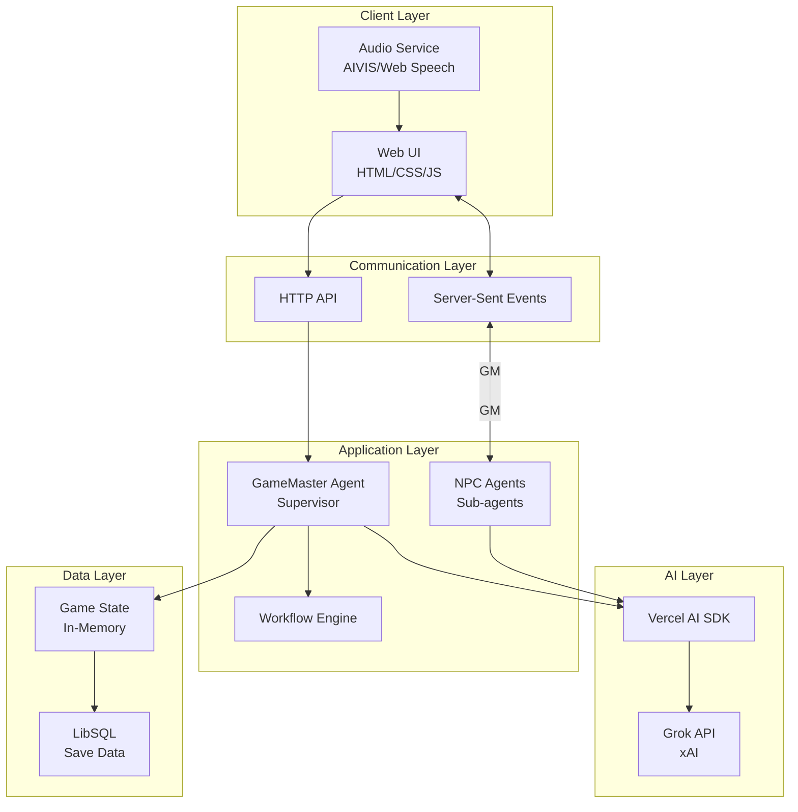

# システムアーキテクチャ設計書

## 1. アーキテクチャ概要

### 1.1 システム構成



### 1.2 コア設計原則

1. **マルチエージェントアーキテクチャ**: Supervisor/Sub-agentパターンによる役割分担
2. **構造化された自由度**: ワークフローエンジンによる物語構造の管理
3. **型安全性**: TypeScriptとZodによる厳格な型管理
4. **モジュラー設計**: 各コンポーネントの独立性と交換可能性

### 1.3 ゲームエンジン実装

プロジェクトは複数のゲーム実装アプローチをサポートする **UnifiedGameEngine** を使用：

```typescript
// src/game/UnifiedGameEngine.ts
export class UnifiedGameEngine {
  private gameMode: 'simple' | 'volt-agent' = 'simple';
  
  async startGame(options?: { demoMode?: boolean }): Promise<void> {
    switch (this.gameMode) {
      case 'simple':
        // 直接的なAI統合、シンプルなアーキテクチャ
        const simpleGame = new SimpleDemonLordRPG();
        break;
        
      case 'volt-agent':
        // Volt Agent フレームワーク、マルチエージェントシステム
        const voltGame = new DemonLordRPG();
        break;
    }
  }
}
```

#### 実装比較

| 実装方式 | 説明 | 状態 | 使用ケース |
|---------|------|------|-----------|
| **Simple** | Grok APIとの直接統合、基本的な画像生成機能 | ✅ 安定 | テスト、開発、デモ |
| **Volt Agent** | 高度なマルチエージェントアーキテクチャ | ⚠️ 開発中 | 本格運用、高度な機能 |

## 2. エージェントアーキテクチャ

### 2.1 Supervisor Pattern

```typescript
// GameMaster Agent (Supervisor)
interface GameMasterAgent {
  name: "GameMaster";
  role: "supervisor";
  subAgents: Agent[];
  responsibilities: [
    "ゲームループ管理",
    "ワールドステート維持",
    "NPCへのタスク委任",
    "プレイヤーコマンド解釈"
  ];
}
```

### 2.2 エージェント階層

| レベル | エージェント | モデル | 役割 |
|--------|------------|--------|------|
| **L1** | GameMaster | grok-4 | 全体統括、複雑な推論 |
| **L2** | StoryTeller | grok-4 | 物語生成、描写 |
| **L2** | EventManager | grok-code-fast-1 | ロジック処理、状態管理 |
| **L3** | NPC_Agents | grok-3-mini | 個別キャラクター |
| **L3** | ImageGenerator | grok-2-image-1212 | ビジュアル生成（$0.07/枚） |

### 2.3 エージェント間通信

```typescript
// メッセージパッシング
interface AgentMessage {
  from: string;
  to: string;
  type: "command" | "query" | "response";
  payload: any;
  context: GameContext;
  priority?: "high" | "normal" | "low";
}

// 実装ガイドへのリンク
// 詳細な実装方法は [IMPLEMENTATION_GUIDE.md](./IMPLEMENTATION_GUIDE.md) を参照

// デリゲーション
class GameMaster {
  async delegateTask(task: Task, targetAgent: string) {
    const agent = this.subAgents.find(a => a.name === targetAgent);
    return await agent.execute(task);
  }
}
```

## 3. 状態管理アーキテクチャ

### 3.1 2層状態管理

```typescript
// 永続状態（LibSQL）
interface PersistentState {
  playerId: string;
  characterSheet: PlayerCharacter;
  inventory: InventoryItem[];
  questLog: Quest[];
  gameFlags: Map<string, boolean>;
}

// 一時状態（userContext）
interface TemporaryState {
  currentLocation: string;
  weather: string;
  combatState?: CombatInfo;
  temporaryBuffs: Buff[];
}
```

### 3.2 状態フロー

```
[Player Action] 
    ↓
[GameMaster processes]
    ↓
[State Update]
    ├─→ [Persistent: LibSQL] (セーブデータ)
    └─→ [Temporary: userContext] (セッション内のみ)
```

## 4. データスキーマ設計

### 4.1 Zodスキーマによる型定義

```typescript
import { z } from 'zod';

// ゲーム状態スキーマ
export const GameStateSchema = z.object({
  currentDay: z.number().int().min(1).max(30),
  playerRole: z.enum([
    "hero", "merchant", "coward", "traitor", "villager"
  ]),
  location: z.string(),
  playerStats: z.object({
    level: z.number(),
    reputation: z.number(),
    knowledge: z.number(),
    allies: z.array(z.string())
  }),
  doomsdayApproach: z.number().min(0).max(100)
});

// エンディング判定スキーマ
export const EndingSchema = z.object({
  type: z.enum([
    "PERFECT_VICTORY",
    "COSTLY_VICTORY", 
    "TACTICAL_RETREAT",
    "DEVASTATING_DEFEAT",
    "ESCAPE_SUCCESS",
    "BETRAYAL_SUCCESS"
  ]),
  score: z.object({
    combat: z.number(),
    knowledge: z.number(),
    alliance: z.number()
  })
});
```

## 5. 通信アーキテクチャ

### 5.1 APIエンドポイント設計

| メソッド | エンドポイント | 用途 | リクエスト | レスポンス |
|---------|--------------|------|-----------|-----------|
| POST | `/command` | コマンド送信 | `{command: string}` | `{success: boolean}` |
| GET | `/events` | SSEストリーム | - | Event Stream |
| GET | `/state` | 現在の状態取得 | - | GameState |
| POST | `/save` | セーブ | `{slot: number}` | `{saved: boolean}` |
| POST | `/load` | ロード | `{slot: number}` | GameState |

### 5.2 Server-Sent Events設計

```typescript
// SSEイベントタイプ
enum EventType {
  NARRATIVE = "narrative",     // 物語テキスト
  STATE_UPDATE = "state",       // 状態更新
  CHOICE = "choice",           // 選択肢提示
  AUDIO = "audio"              // 音声データ
}

// イベント構造
interface GameEvent {
  type: EventType;
  data: any;
  timestamp: number;
}
```

## 6. 拡張性考慮事項

### 6.1 プラグインアーキテクチャ

```typescript
// 新しいNPCの追加
class CustomNPCAgent extends Agent {
  // 実装
}

// エージェントレジストリに登録
agentRegistry.register("customNPC", CustomNPCAgent);
```

### 6.2 音声サービスの抽象化

```typescript
// 音声サービスインターフェース
interface IAudioService {
  speak(text: string, voice?: string): Promise<void>;
  getVoices(): Promise<Voice[]>;
}

// 実装の切り替え可能
class AIVISService implements IAudioService { }
class WebSpeechService implements IAudioService { }
class MockAudioService implements IAudioService { }
```

## 7. パフォーマンス最適化

### 7.1 コスト最適化戦略

| タスク種別 | 使用モデル | 理由 |
|-----------|-----------|------|
| 複雑な物語生成 | grok-4 | 高品質な出力が必要 |
| 単純な対話 | grok-3-mini | コスト効率重視 |
| ロジック処理 | grok-code-fast-1 | 高速処理が必要 |
| 繰り返し処理 | キャッシュプロンプト | 75%のコスト削減 |

### 7.2 レスポンス最適化

- **ストリーミング**: `streamText`による段階的表示
- **キャッシング**: 頻出プロンプトのキャッシュ
- **バッチ処理**: 複数NPCの応答を並列処理

## 8. セキュリティ考慮事項

### 8.1 APIキー管理

```bash
# 環境変数での管理
XAI_API_KEY=xxx
AIVIS_API_KEY=xxx

# .gitignoreに追加
.env
.env.local
```

### 8.2 入力検証

```typescript
// ユーザー入力のサニタイゼーション
function sanitizeCommand(input: string): string {
  return input
    .trim()
    .slice(0, MAX_COMMAND_LENGTH)
    .replace(/[<>]/g, '');
}
```

## 9. デバッグとモニタリング

### 9.1 VoltOps統合

```typescript
// トレーシング設定
const voltOpsClient = new VoltOpsClient({
  apiKey: process.env.VOLTOPS_API_KEY,
  enableTracing: true
});
```

### 9.2 ログ戦略

| レベル | 内容 | 例 |
|--------|------|-----|
| ERROR | システムエラー | API接続失敗 |
| WARN | 警告事項 | レート制限接近 |
| INFO | 重要イベント | ゲーム開始/終了 |
| DEBUG | デバッグ情報 | エージェント間通信 |

## 10. 将来の拡張計画

### 10.1 ロードマップ

1. **Phase 1 (MVP)**: テキストベース基本機能
2. **Phase 2**: 音声合成統合、UIの改善
3. **Phase 3**: マルチプレイヤー、ビジュアル要素
4. **Phase 4**: MOD対応、コミュニティ機能

### 10.2 技術的拡張ポイント

- **RAGシステム**: より深い世界観の構築
- **画像生成**: grok-2-imageによるビジュアル強化
- **リアルタイムコラボ**: WebRTCによる協力プレイ

---

*このアーキテクチャは継続的に改善されます。変更提案はIssueでお願いします。*
