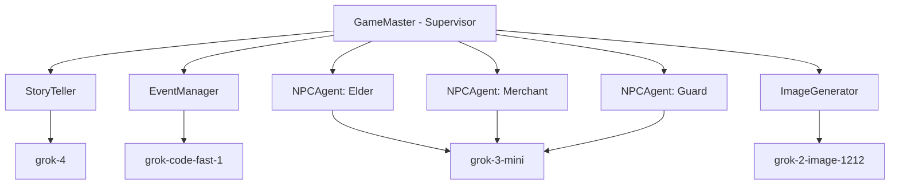
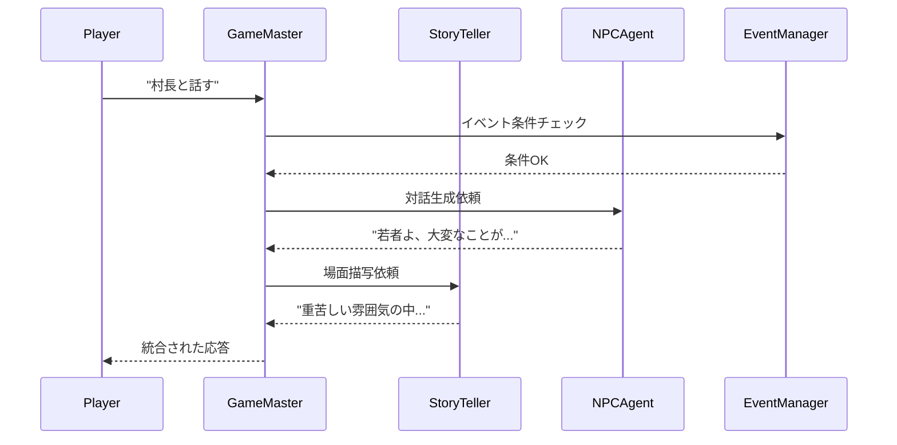

# エージェント仕様書

## 1. エージェントアーキテクチャ概要

### 1.1 エージェント階層



## 2. GameMaster Agent（Supervisor）

### 2.1 基本仕様

```typescript
interface GameMasterSpec {
  name: "GameMaster";
  model: "grok-4";
  role: "supervisor";
  
  responsibilities: [
    "ゲーム全体の進行管理",
    "プレイヤー入力の解釈",
    "適切なサブエージェントへのタスク委譲",
    "ゲーム状態の一元管理",
    "エンディング判定"
  ];
  
  tools: [
    "delegate_task",
    "update_game_state",
    "check_conditions",
    "trigger_event"
  ];
}
```

### 2.2 Instructions テンプレート

```typescript
const gameMasterInstructions = `
あなたは「30日後の魔王襲来」のゲームマスターです。

## 役割
- プレイヤーの行動を解釈し、適切に処理する
- ゲーム世界の一貫性を保つ
- 各NPCエージェントに適切なタスクを委譲する
- 30日間のカウントダウンを管理する

## ゲーム設定
- 舞台: 始まりの村「アルファ」
- 期限: 30日後に魔王が襲来
- プレイヤー: ${playerRole}として行動

## 処理フロー
1. プレイヤーの入力を受け取る
2. 現在の状況と照らし合わせて妥当性を判断
3. 必要に応じてサブエージェントに委譲
4. 結果を物語として出力
5. ゲーム状態を更新

## 制約
- 30日を超えてゲームを続行しない
- プレイヤーの役割に応じた選択肢を提示
- 一貫性のある世界観を維持

## 現在の状態
- 日付: Day ${currentDay}/30
- 場所: ${location}
- 緊張度: ${tensionLevel}%
`;
```

### 2.3 実装例

```typescript
import { Agent } from '@voltagent/core';
import { VercelAIProvider } from '@voltagent/vercel-ai';
import { xai } from '@ai-sdk/xai';

export class GameMasterAgent extends Agent {
  private gameState: GameState;
  private subAgents: Map<string, Agent>;
  
  constructor(initialState: GameState) {
    super({
      name: 'GameMaster',
      instructions: gameMasterInstructions,
      llm: new VercelAIProvider(),
      model: xai('grok-4'),
      tools: [
        {
          name: 'delegate_task',
          description: 'サブエージェントにタスクを委譲',
          parameters: z.object({
            agentName: z.string(),
            task: z.string(),
            context: z.any()
          }),
          execute: async (params) => {
            return await this.delegateToAgent(params);
          }
        },
        {
          name: 'update_game_state',
          description: 'ゲーム状態を更新',
          parameters: GameStateSchema,
          execute: async (params) => {
            this.gameState = { ...this.gameState, ...params };
            return { success: true };
          }
        }
      ]
    });
    
    this.gameState = initialState;
    this.initializeSubAgents();
  }
  
  private async delegateToAgent(params: any) {
    const agent = this.subAgents.get(params.agentName);
    if (!agent) {
      throw new Error(`Agent ${params.agentName} not found`);
    }
    
    return await agent.generateText({
      prompt: params.task,
      userContext: {
        ...this.gameState,
        ...params.context
      }
    });
  }
}
```

## 3. StoryTeller Agent

### 3.1 基本仕様

```typescript
interface StoryTellerSpec {
  name: "StoryTeller";
  model: "grok-4";
  role: "narrative_generator";
  
  responsibilities: [
    "物語の生成と描写",
    "雰囲気の演出",
    "感情的な表現",
    "詩的な言い回し"
  ];
  
  style: {
    tone: "epic_fantasy";
    perspective: "second_person"; // "あなたは..."
    verbosity: "detailed";
    humor: "occasional"; // Grokの特性を活かす
  };
}
```

### 3.2 Instructions テンプレート

```typescript
const storyTellerInstructions = `
あなたは熟練した物語の語り手です。

## スタイルガイド
- 二人称視点で語る（「あなたは...」）
- ファンタジー小説のような描写的な文体
- 時折ユーモアや皮肉を交える（Grokの個性）
- 五感に訴える描写を心がける

## 描写の要素
- 視覚: 色、光、影、形
- 聴覚: 音、声、静寂
- 嗅覚: 匂い、香り
- 触覚: 質感、温度
- 感情: 緊張、恐怖、希望、絶望

## 場面別の演出
- 戦闘: 緊迫感とスピード感
- 探索: 神秘性と発見の喜び
- 対話: キャラクターの個性
- 危機: 切迫感と選択の重さ

## 現在の雰囲気
緊張度: ${tensionLevel}%
${getTensionDescription(tensionLevel)}
`;
```

## 4. EventManager Agent

### 4.1 基本仕様

```typescript
interface EventManagerSpec {
  name: "EventManager";
  model: "grok-code-fast-1"; // ロジック処理に特化
  role: "logic_processor";
  
  responsibilities: [
    "イベント発生条件の判定",
    "ゲームロジックの処理",
    "確率計算と乱数処理",
    "状態遷移の管理"
  ];
  
  tools: [
    "check_event_conditions",
    "calculate_probability",
    "process_combat",
    "manage_resources"
  ];
}
```

### 4.2 実装例

```typescript
export class EventManagerAgent extends Agent {
  constructor() {
    super({
      name: 'EventManager',
      instructions: `
        あなたはゲームのロジック処理を担当します。
        正確な計算と条件判定を行い、結果をJSON形式で返します。
        創造的な解釈は避け、ルールに従った処理を行ってください。
      `,
      llm: new VercelAIProvider(),
      model: xai('grok-code-fast-1'),
      tools: [
        {
          name: 'calculate_combat',
          description: '戦闘結果を計算',
          parameters: z.object({
            playerStats: PlayerStatsSchema,
            enemyStats: EnemyStatsSchema
          }),
          execute: async (params) => {
            return this.resolveCombat(params);
          }
        }
      ]
    });
  }
  
  private resolveCombat(params: any): CombatResult {
    const { playerStats, enemyStats } = params;
    const playerPower = playerStats.strength + playerStats.weaponBonus;
    const enemyPower = enemyStats.strength;
    
    const ratio = playerPower / enemyPower;
    
    if (ratio > 2.0) return { result: "OVERWHELMING_VICTORY", damage: 0 };
    if (ratio > 1.5) return { result: "VICTORY", damage: 10 };
    if (ratio > 1.0) return { result: "NARROW_VICTORY", damage: 25 };
    if (ratio > 0.7) return { result: "COSTLY_VICTORY", damage: 50 };
    return { result: "DEFEAT", damage: 100 };
  }
}
```

## 5. NPC Agents

### 5.1 NPCエージェント基底クラス

```typescript
abstract class NPCAgent extends Agent {
  protected personality: NPCPersonality;
  protected knowledge: string[];
  protected relationship: number = 0;
  
  constructor(config: NPCConfig) {
    super({
      name: config.name,
      instructions: NPCAgent.buildInstructions(config),
      llm: new VercelAIProvider(),
      model: xai('grok-3-mini'), // コスト最適化
      tools: config.tools || []
    });
    
    this.personality = config.personality;
    this.knowledge = config.knowledge;
  }
  
  private static buildInstructions(config: NPCConfig): string {
    return `
あなたは${config.name}という${config.role}です。

## 性格
${config.personality.traits.join(', ')}

## 話し方
${config.personality.speechStyle}

## 知識
${config.knowledge.join('\n')}

## 制約
- 知らないことは知らないと答える
- 性格に一貫性を保つ
- プレイヤーとの関係性を考慮する

## 現在の関係性
${config.relationship || 0}/100
    `;
  }
}
```

### 5.2 具体的なNPC実装例

```typescript
// 村長エージェント
export class ElderMorganAgent extends NPCAgent {
  constructor() {
    super({
      name: 'Elder Morgan',
      role: '村長',
      personality: {
        traits: ['威厳がある', '保守的', '責任感が強い', '時に頑固'],
        speechStyle: '丁寧だが権威的な口調。「じゃ」「のう」などの老人語を使う。'
      },
      knowledge: [
        '村の歴史と伝統',
        '古い予言の内容',
        '村人たちの秘密',
        '魔王に関する言い伝え'
      ],
      tools: [
        {
          name: 'give_quest',
          description: 'クエストを与える',
          parameters: QuestSchema
        }
      ]
    });
  }
}

// 商人エージェント
export class MerchantGromAgent extends NPCAgent {
  constructor() {
    super({
      name: 'Grom',
      role: '鍛冶屋兼商人',
      personality: {
        traits: ['無骨', '正直', '商売熱心', '実は心優しい'],
        speechStyle: '短く簡潔。必要最小限のことしか話さない。'
      },
      knowledge: [
        '武器と防具の知識',
        '他の村の情勢',
        '商品の相場',
        '冒険者の噂'
      ],
      tools: [
        {
          name: 'show_inventory',
          description: '商品リストを表示',
          execute: async () => this.getInventory()
        },
        {
          name: 'trade',
          description: 'アイテムの売買',
          parameters: TradeSchema
        }
      ]
    });
  }
  
  private getInventory(): InventoryList {
    // 日数に応じて商品と価格を変動
    const day = this.context.currentDay;
    const panicMultiplier = Math.min(day / 10, 3);
    
    return {
      items: [
        { name: '鉄の剣', price: 100 * panicMultiplier },
        { name: 'ポーション', price: 50 * panicMultiplier },
        // ...
      ]
    };
  }
}
```

## 6. ImageGenerator Agent

### 6.1 基本仕様

```typescript
interface ImageGeneratorSpec {
  name: "ImageGenerator";
  model: "grok-2-image-1212";
  role: "visual_creator";
  
  responsibilities: [
    "場面の視覚化",
    "アイテムの描画",
    "キャラクターポートレート生成",
    "マップや図解の作成"
  ];
  
  constraints: [
    "ファンタジー世界観の統一",
    "コスト管理（$0.07/枚）",
    "生成は重要な場面のみ"
  ];
}
```

### 6.2 実装例

```typescript
export class ImageGeneratorAgent extends Agent {
  private generationCount = 0;
  private costLimit = 10.0; // $10制限
  
  constructor() {
    super({
      name: 'ImageGenerator',
      instructions: `
        ファンタジーRPGの世界観に合った画像を生成します。
        中世ヨーロッパ風の世界観を基調とし、
        ダークファンタジーの要素を含めてください。
      `,
      llm: new VercelAIProvider(),
      model: xai('grok-2-image-1212'),
      tools: [
        {
          name: 'generate_image',
          description: '画像を生成',
          parameters: z.object({
            prompt: z.string(),
            style: z.enum(['realistic', 'anime', 'painting'])
          }),
          execute: async (params) => {
            return await this.generateImage(params);
          }
        }
      ]
    });
  }
  
  private async generateImage(params: any) {
    // コスト確認
    const currentCost = this.generationCount * 0.07;
    if (currentCost >= this.costLimit) {
      return {
        success: false,
        message: '画像生成の予算上限に達しました'
      };
    }
    
    // プロンプト最適化
    const optimizedPrompt = this.optimizePrompt(params.prompt, params.style);
    
    // 画像生成（実際のAPI呼び出し）
    const result = await this.llm.generateImage({
      prompt: optimizedPrompt,
      model: this.model
    });
    
    this.generationCount++;
    
    return {
      success: true,
      imageUrl: result.url,
      cost: 0.07
    };
  }
  
  private optimizePrompt(prompt: string, style: string): string {
    const stylePrompts = {
      realistic: 'photorealistic, highly detailed, 8k resolution',
      anime: 'anime style, cel shaded, vibrant colors',
      painting: 'oil painting, classical art style, renaissance'
    };
    
    return `${prompt}, fantasy RPG setting, ${stylePrompts[style]}`;
  }
}
```

## 7. エージェント間通信プロトコル

### 7.1 メッセージ形式

```typescript
interface AgentMessage {
  id: string;
  timestamp: number;
  from: string;
  to: string;
  type: MessageType;
  payload: any;
  context: GameContext;
  priority: Priority;
}

enum MessageType {
  COMMAND = "command",
  QUERY = "query",
  RESPONSE = "response",
  EVENT = "event",
  ERROR = "error"
}

enum Priority {
  CRITICAL = 0,
  HIGH = 1,
  NORMAL = 2,
  LOW = 3
}
```

### 7.2 通信フロー例



## 8. パフォーマンス最適化ガイドライン

### 8.1 モデル選択基準

| タスク | 推奨モデル | 理由 | コスト |
|-------|-----------|------|-------|
| 複雑な推論 | grok-4 | 高度な理解力 | 高 |
| 単純な対話 | grok-3-mini | 十分な性能 | 低 |
| コード/ロジック | grok-code-fast-1 | 特化型 | 中 |
| 画像生成 | grok-2-image-1212 | 唯一の選択 | 固定 |

### 8.2 キャッシュ戦略

```typescript
class AgentCache {
  private cache = new LRUCache<string, CachedResponse>({
    max: 100,
    ttl: 1000 * 60 * 5 // 5分
  });
  
  getCacheKey(agent: string, prompt: string, context: any): string {
    return crypto
      .createHash('md5')
      .update(`${agent}:${prompt}:${JSON.stringify(context)}`)
      .digest('hex');
  }
  
  async getOrGenerate(
    agent: Agent,
    prompt: string,
    context: any
  ): Promise<string> {
    const key = this.getCacheKey(agent.name, prompt, context);
    
    const cached = this.cache.get(key);
    if (cached) {
      return cached.response;
    }
    
    const response = await agent.generateText({ prompt, context });
    this.cache.set(key, { response: response.text });
    
    return response.text;
  }
}
```

---

*このエージェント仕様書は、各エージェントの実装と連携方法を定義しています。*
