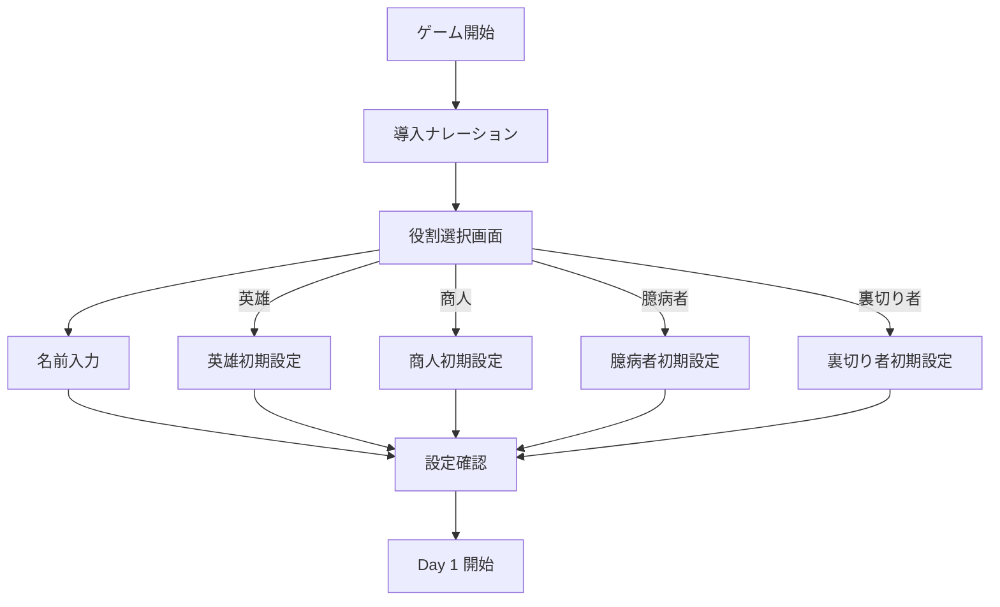
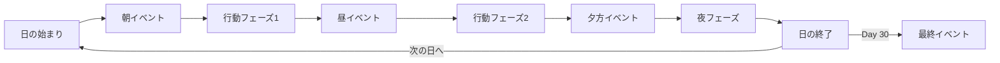
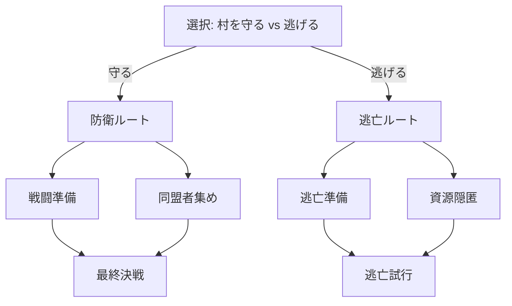
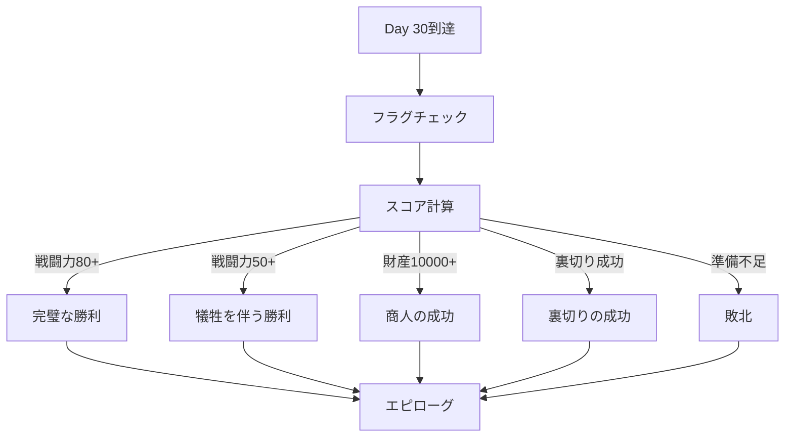

# ゲームフロー仕様書

## 1. ゲーム開始フロー



## 2. 日次ゲームループ

### 2.1 1日の流れ



### 2.2 行動フェーズ詳細

```typescript
interface ActionPhase {
  availableActions: number; // 通常2-3
  choices: Choice[];
  timeLimit?: number; // オプション：制限時間
}

interface Choice {
  id: string;
  text: string;
  requirements?: {
    stats?: StatRequirement;
    items?: string[];
    flags?: string[];
  };
  consequences: {
    immediate: ConsequenceEffect[];
    delayed?: DelayedEffect[];
  };
}
```

## 3. イベントシステム

### 3.1 イベントの種類

| タイプ | 発生タイミング | 頻度 | 例 |
|-------|--------------|------|-----|
| **固定イベント** | 特定の日 | 100% | Day 10: 偵察隊出現 |
| **ランダムイベント** | ランダム | 確率制御 | 商人の来訪 |
| **条件イベント** | 条件達成時 | 条件依存 | 評判50以上で英雄認定 |
| **連鎖イベント** | 前イベント完了後 | 100% | クエストチェーン |

### 3.2 イベント優先度

```typescript
enum EventPriority {
  CRITICAL = 0,    // 必ず発生（Day 30など）
  HIGH = 1,        // 重要イベント
  MEDIUM = 2,      // 通常イベント
  LOW = 3,         // 補助イベント
}

// イベントスケジューラー
class EventScheduler {
  getNextEvent(day: number, gameState: GameState): Event {
    const candidates = this.getAllCandidates(day, gameState);
    return this.selectByPriority(candidates);
  }
}
```

## 4. 分岐システム

### 4.1 選択による分岐



### 4.2 条件分岐の実装

```typescript
interface BranchCondition {
  type: "stat" | "item" | "flag" | "relationship" | "random";
  check: (gameState: GameState) => boolean;
}

class StoryBranch {
  evaluate(conditions: BranchCondition[], gameState: GameState): string {
    for (const condition of conditions) {
      if (condition.check(gameState)) {
        return this.getBranchPath(condition);
      }
    }
    return "default";
  }
}
```

## 5. 進行管理システム

### 5.1 フラグ管理

```typescript
interface StoryFlags {
  // メインストーリー
  prophecyRevealed: boolean;
  villageWarned: boolean;
  defensesPrepared: boolean;
  
  // サイドクエスト
  merchantQuestStarted: boolean;
  ancientSwordFound: boolean;
  spyIdentified: boolean;
  
  // 関係性
  elderTrust: boolean;
  merchantAlliance: boolean;
  
  // 特殊ルート
  secretPathUnlocked: boolean;
  betrayalRevealed: boolean;
}
```

### 5.2 進行状態の保存

```typescript
interface ProgressState {
  currentDay: number;
  currentPhase: "morning" | "noon" | "evening" | "night";
  completedEvents: string[];
  activeQuests: Quest[];
  storyFlags: StoryFlags;
  decisions: Decision[];
}

class ProgressManager {
  save(state: ProgressState): void {
    // LibSQLStorageに保存
  }
  
  load(saveId: string): ProgressState {
    // セーブデータから復元
  }
  
  canProgress(state: ProgressState): boolean {
    // 進行可能かチェック
    return state.currentPhase === "night" || 
           state.currentDay < 30;
  }
}
```

## 6. エンディング判定フロー

### 6.1 エンディング到達フロー



### 6.2 スコア計算ロジック

```typescript
class EndingCalculator {
  calculate(state: GameState): EndingType {
    const scores = {
      combat: this.calculateCombatScore(state),
      wealth: this.calculateWealthScore(state),
      survival: this.calculateSurvivalScore(state),
      betrayal: this.calculateBetrayalScore(state),
    };
    
    // 役割ごとの重み付け
    const weights = this.getWeightsByRole(state.playerRole);
    
    // 最終スコア計算
    const finalScore = Object.entries(scores).reduce(
      (total, [key, value]) => total + value * weights[key],
      0
    );
    
    return this.determineEnding(finalScore, state);
  }
  
  private getWeightsByRole(role: PlayerRole): Record<string, number> {
    const weights = {
      hero: { combat: 2.0, wealth: 0.5, survival: 1.0, betrayal: 0 },
      merchant: { combat: 0.5, wealth: 2.0, survival: 1.0, betrayal: 0.5 },
      coward: { combat: 0.2, wealth: 0.8, survival: 2.0, betrayal: 0.5 },
      traitor: { combat: 0.5, wealth: 1.0, survival: 0.8, betrayal: 2.0 },
    };
    return weights[role] || weights.hero;
  }
}
```

## 7. 特殊ルート

### 7.1 隠しルート解放条件

| ルート名 | 解放条件 | 結果 |
|---------|---------|------|
| **和平ルート** | 知識90+、古代の書を所持 | 魔王との交渉可能 |
| **真の英雄** | 全NPC生存、村無傷 | 伝説として語り継がれる |
| **影の支配者** | 裏切り者で両陣営を操作 | 新たな支配者に |
| **時の旅人** | 特定のアイテム収集 | 時間遡行エンディング |

### 7.2 イースターエッグ

```typescript
const easterEggs = {
  // 名前による特殊対応
  checkSpecialNames: (name: string): boolean => {
    const special = ["Frodo", "Link", "Mario", "魔王"];
    return special.includes(name);
  },
  
  // 特定の行動パターン
  checkActionPattern: (actions: string[]): boolean => {
    // 上上下下左右左右BA的な
    return actions.join(",") === "north,north,south,south,east,west,east,west";
  },
  
  // 特定の日付・時刻
  checkRealWorldTime: (): boolean => {
    const now = new Date();
    return now.getMonth() === 11 && now.getDate() === 31; // 大晦日
  }
};
```

## 8. 難易度調整

### 8.1 動的難易度調整

```typescript
class DifficultyManager {
  private playerPerformance: number = 50; // 0-100
  
  adjustDifficulty(state: GameState): void {
    // プレイヤーの成績を評価
    this.evaluatePerformance(state);
    
    // 難易度調整
    if (this.playerPerformance < 30) {
      this.makeEasier(state);
    } else if (this.playerPerformance > 70) {
      this.makeHarder(state);
    }
  }
  
  private makeEasier(state: GameState): void {
    // ヒントを増やす
    // 報酬を増やす
    // 敵を弱くする
  }
  
  private makeHarder(state: GameState): void {
    // 選択肢を減らす
    // コストを増やす
    // イベントを厳しくする
  }
}
```

---

*このフロー仕様書は、ゲームの進行を制御する核心的なロジックを定義しています。*
